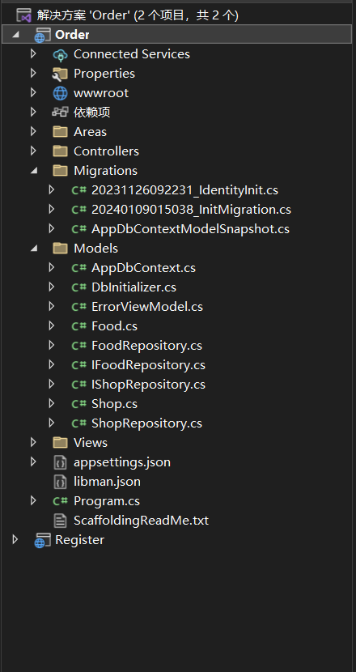
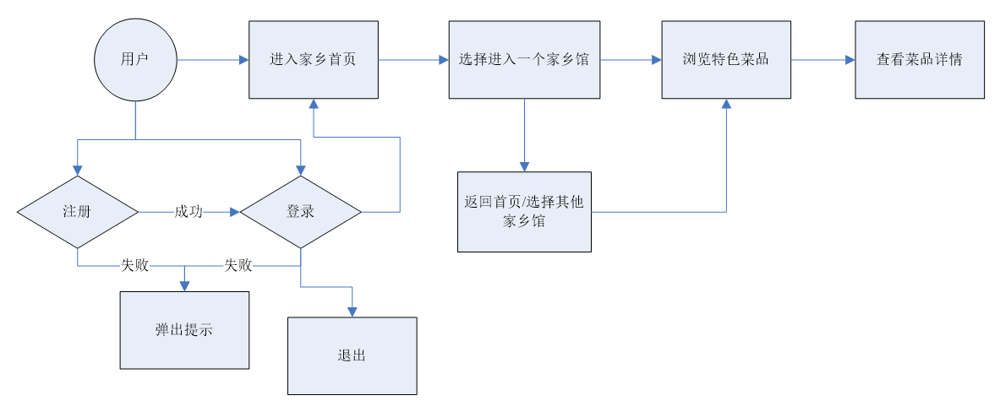
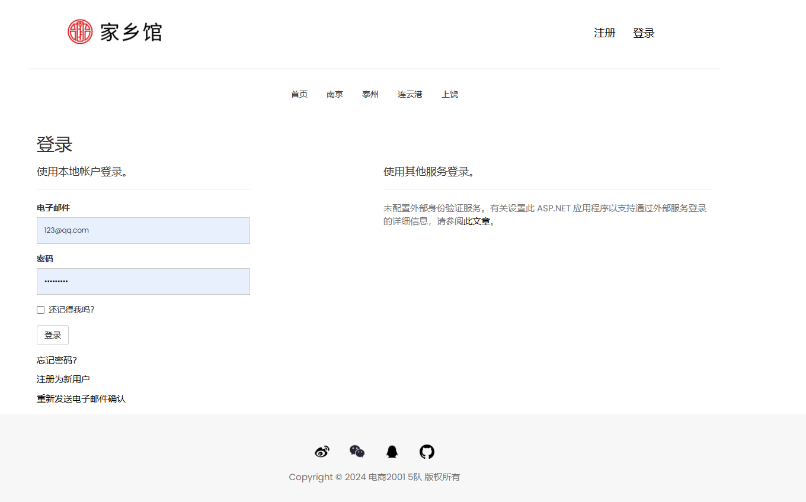

# Home Exhibition System
A simple hometown exhibition and shopping system built on .NET 7.0, utilizing an ASP.NET backend and SQL Server database.

一个基于.NET 7.0的，运用ASP.NET后端和SQL Server数据库的简单家乡展览与购物系统。

## 🚀 功能特点
- 账户管理：注册、登录、个人资料修改
- 首页展示：主题家乡陈列，栏目简介与入口
- 购物：商品陈列，商品详情，购买与收藏

## 🛠️ 技术栈
- **Frontend**
  - HTML5, CSS3, JavaScript
  - Bootstrap
- **Backend**
  - ASP.NET (C#)
- **Database**
  - SQL Server
- **Tools**
  - Visual Studio, GitHub, SQL Server Management Studio

## 📂 项目结构

  
   
   
   

## ⚡ 快速开始
1. `git clone https://github.com/Burgess0/HomeExhibition.git`
2. 打开数据库
3. 在Visual Studio打开`Project/Order.sln`项目文件
4. 启动ASP.NET服务
5. 访问 `https://localhost:44396`

## 📷 演示截图

  
  
  
  
  
  

## 🎯 项目亮点
- 完成 系统设计、开发与测试
- 前后端分离，结构清晰
- 包含完整数据库设计与交互
- 项目代码托管在 GitHub

## 📌 作者
- Hualong Zhang，zhlong032@gmail.com
